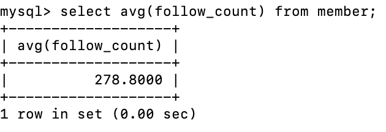

# Task-3

## 1 & 2. create five data and show all them

## 3. sort data by descending time

## 4. sort data and select data from second to forth

## 5.select data whose username is test

## 6. select data whose username and password is test

## 7. update name with test2 when username is test

# Task-4

## 1. count all data

## 2. sum all the follow_count

## 3. take average of all the follow_count

# Task-5
